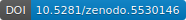

.. This file is automaticaly generated. Do not edit.

`Climate induced economic shocks using CLIMRISK <https://zenodo.org/record/5530146>`_
=====================================================================================

.. index::
   single: CLIMRISK
   single: climate risk-measures
   single: multivariate risk index
   single: risk-measures
   single: absolute risk
   single: relative risk
   single: multivariate risk indices

Description:
------------

Various risk measures of climate induced economic shocks using CLIMRISK. Metrics include year of exceeding 1 billion in climate damages, year of exceeding 5% annual GDP lost and a multivariate risk index (1 billion, 5% GDP and 3 degrees temperature exceedance).

COACCH-Specific Metadata:
-------------------------

- **Sector**: Direct impacts
- **Partner**: IVM - VU
- **SSP**: SSP1, SSP2, SSP3, SSP4, SSP5
- **RCP**: RCP2.6, RCP4.5, RCP6.0, RCP8.5
- **Spatial resolution Europe**: NUTS2 2013
- **Keywords**: CLIMRISK, risk-measures, absolute risk, relative risk, multivariate risk indices

Authors:
--------
Ignjacevic, Predrag

.. meta::
   :keywords: COACCH, CLIMRISK, climate risk-measures, absolute risk, relative risk, multivariate risk index
    